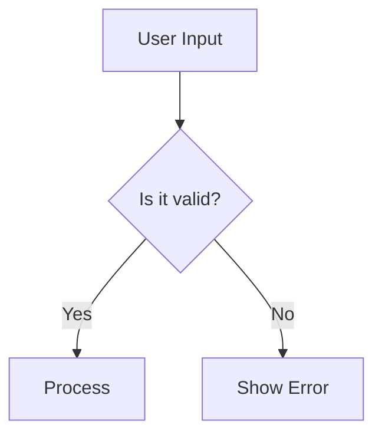

# ai-markdown

[Website](https://ai-markdown.github.io/) · [Documentation](https://ai-markdown.github.io/docs/) · [Interactive examples](https://ai-markdown.github.io/examples/)

Render streaming Markdown in React and Vue, with shared parsing and document coordination. Start with the package README below or follow the [getting started guide](https://ai-markdown.github.io/docs/guides/getting-started/).

[](https://github.com/ai-markdown/ai-markdown/actions/workflows/ci.yml)
[](https://github.com/ai-markdown/ai-markdown/releases)
[](./LICENSE)

[](./packages/react#readme)
[](./packages/vue#readme)
[](./packages/react-mantine#readme)

> **Since 3.0.0:** React and Vue adapters share the public `@ai-markdown/core` and `@ai-markdown/engine` packages. See the [migration guide](https://ai-markdown.github.io/docs/guides/framework-transition/).

> React and Vue Markdown rendering for AI responses: GFM, KaTeX math, CJK-aware parsing, incremental streaming, and shared references across logical document sections. Use either framework adapter with your own UI, or the React Mantine integration for highlighted code, JSON presentation, and Mermaid diagrams.

> **Upgrading from 1.x?** v2.0.0 removes the 1.x object-based `config` channel (and its integrator default channel) in favor of flat props, a sealed engine-plugin catalog, and five narrow hooks. Every removed symbol has a one-to-one destination with before/after code in the [migration guide](https://ai-markdown.github.io/docs/guides/migrating-to-v2/).

---

## Why ai-markdown?

An AI response changes while the user reads it. A fence may be incomplete, a citation definition may arrive after its reference, and a large answer may receive many small updates. The renderer needs to preserve the meaning of those intermediate snapshots while keeping repeated work manageable.

ai-markdown addresses those concerns at distinct layers:

- **Accumulated streaming input.** Pass the complete current Markdown string to one component. The engine reuses a verified prefix when the input is an append and the grammar permits it; otherwise it uses a full parse.
- **Reusable rendered blocks.** The React adapter retains React elements for unchanged plans. Custom components can still update through state and context, so streaming status and application callbacks remain live.
- **Logical document sections.** When an application deliberately uses multiple renderers for one document, `AIMarkdownDocuments` shares footnote and link/image definitions under an explicit document id. It does not join syntax split across arbitrary network packets.
- **Math and mixed-language text.** Built-in normalization handles common model-produced math delimiters and currency text. The pipeline includes CJK-aware delimiter parsing and optional pangu spacing; typography and source line breaks remain explicit presentation choices.
- **Controlled output policy.** The sanitizer filters the tree before URL transformation. Schema extensions, custom components, and application URL schemes are supported through typed inputs whose scope and precedence are documented.

Choose `@ai-markdown/react` for React rendering or `@ai-markdown/vue` for Vue 3.5 rendering with your own presentation. Choose Mantine when you also want its providers, typography, highlighted code controls, and diagrams. React and Vue share parsing and coordination algorithms, with framework-specific component APIs. See [Getting started](https://ai-markdown.github.io/docs/guides/getting-started/) for complete setup and the API differences.

## Features

Parsing features are shared by React and Vue. The context hooks, typography slots and React-node cache described below belong to the React adapter; Mantine adds its React UI features. For Vue equivalents and limitations, see the [API comparison](https://ai-markdown.github.io/docs/guides/getting-started/#react-and-vue-api-differences).

|                              |                                                                                                                                                                                                                                                                                                                                    |
| ---------------------------- | ---------------------------------------------------------------------------------------------------------------------------------------------------------------------------------------------------------------------------------------------------------------------------------------------------------------------------------- |
| **GFM**                      | tables, strikethrough, task lists, autolinks (via `remark-gfm`)                                                                                                                                                                                                                                                                    |
| **LaTeX math**               | inline `$…$` and display `$$…$$` via KaTeX, with smart preprocessing for currency `$`, bracket delimiters (`\[…\]`, `\(…\)`), pipe escaping, and [mhchem](https://mhchem.github.io/MathJax-mhchem/) commands (chemistry formulas like `\ce{H2O}`)                                                                                  |
| **Mermaid diagrams**         | interactive SVG with dark/light themes, source toggle, copy, open-in-new-window (in `@ai-markdown/react-mantine`)                                                                                                                                                                                                                  |
| **Syntax highlighting**      | language-labelled tabs, expand/collapse, optional `highlight.js` auto-detection for unlabelled blocks (in `@ai-markdown/react-mantine`)                                                                                                                                                                                            |
| **CJK-friendly**             | CJK-aware emphasis and strikethrough parsing, source newlines rendered as breaks, plus optional [pangu](https://github.com/vinta/pangu.js) auto-spacing between CJK and half-width characters                                                                                                                                      |
| **Streaming-aware**          | `streaming` flag is propagated via context; custom renderers can show cursors, skip animations, or disable copy buttons during streaming                                                                                                                                                                                           |
| **Streaming cursor**         | built-in `streamingCursor` slot renders a "still generating" indicator after the last streamed character — visible through token stalls, pure-CSS animation, zero impact on the parse pipeline                                                                                                                                     |
| **Smooth streaming**         | `<AIMarkdownSmoothStream>` reveals bursty token chunks as a steady grapheme-by-grapheme typewriter; a completion-deadline pacing law tracks the source's cadence — coarse proxy-buffered feeds included (three presets: smooth / balanced / responsive) and append frames can use incremental parsing when its safety gates permit |
| **Cross-chunk coordination** | `<AIMarkdownDocuments>` wrapper lets chunked chat messages share a `documentId` so footnotes / link refs / image refs resolve across chunks                                                                                                                                                                                        |
| **Block-level memoization**  | each markdown block is memoized by source identity; unchanged plans reuse React elements during streaming; equivalence tests compare optimized and full paths. Child state/context can still update                                                                                                                                |
| **Emoji shortcodes**         | `:smile:` → 😄 via `remark-emoji`                                                                                                                                                                                                                                                                                                  |
| **Extra syntax**             | `==highlight==`, definition lists (PHP Markdown Extra)                                                                                                                                                                                                                                                                             |
| **Display optimizations**    | SmartyPants typography, HTML comment removal, pangu CJK spacing                                                                                                                                                                                                                                                                    |
| **Customizable URL safety**  | two-gate XSS protection (`urlTransform` + `rehype-sanitize`); helper to extend the schema without breaking library invariants                                                                                                                                                                                                      |
| **Custom components**        | swap any HTML-element renderer with a typed component; library defaults are merged underneath                                                                                                                                                                                                                                      |
| **Custom typography**        | drop-in `Typography` slot with full CSS-variable token surface for spacing, headings, weight, colors                                                                                                                                                                                                                               |
| **Metadata context**         | pass arbitrary data to nested custom components without prop drilling — a separate context so its subscribers update independently of state-only consumers                                                                                                                                                                         |
| **TypeScript**               | first-class metadata generic and fully typed flat props; full IDE autocompletion                                                                                                                                                                                                                                                   |
| **React 19**                 | uses native `useId()`, properly typed for the current React version                                                                                                                                                                                                                                                                |

## Packages

| Package                                                                  | Role                                                                     | Version                                                                                                                                                                                                                                   | Downloads                                                                                                                                                                                                                        |
| ------------------------------------------------------------------------ | ------------------------------------------------------------------------ | ----------------------------------------------------------------------------------------------------------------------------------------------------------------------------------------------------------------------------------------- | -------------------------------------------------------------------------------------------------------------------------------------------------------------------------------------------------------------------------------- |
| [`@ai-markdown/react`](./packages/react)                                 | React renderer, hooks and customizable typography.                       | [](https://www.npmjs.com/package/@ai-markdown/react?activeTab=versions)                                                                 | [](https://www.npmjs.com/package/@ai-markdown/react)                                                 |
| [`@ai-markdown/vue`](./packages/vue)                                     | Vue renderer, scoped slots and SSR/hydration.                            | [](https://www.npmjs.com/package/@ai-markdown/vue?activeTab=versions)                                                                       | [](https://www.npmjs.com/package/@ai-markdown/vue)                                                       |
| [`@ai-markdown/react-mantine`](./packages/react-mantine)                 | React + Mantine typography, highlighted code and Mermaid.                | [](https://www.npmjs.com/package/@ai-markdown/react-mantine?activeTab=versions)                                         | [](https://www.npmjs.com/package/@ai-markdown/react-mantine)                         |
| [`@ai-markdown/core`](./packages/core)                                   | Framework-independent sessions, block plans and coordination.            | [](https://www.npmjs.com/package/@ai-markdown/core?activeTab=versions)                                                                    | [](https://www.npmjs.com/package/@ai-markdown/core)                                                    |
| [`@ai-markdown/engine`](./packages/engine)                               | Parsing, preprocessing, incremental algorithms and reference registries. | [](https://www.npmjs.com/package/@ai-markdown/engine?activeTab=versions)                                                              | [](https://www.npmjs.com/package/@ai-markdown/engine)                                              |
| [`@ai-markdown/remark-mark-highlight`](./packages/remark-mark-highlight) | Standalone remark plugin for `==mark==` syntax.                          | [](https://www.npmjs.com/package/@ai-markdown/remark-mark-highlight?activeTab=versions) | [](https://www.npmjs.com/package/@ai-markdown/remark-mark-highlight) |

The five framework/shared packages track `latest`; the independent highlight plugin tracks `latest`. Download counts are package-wide monthly totals across all versions, not counts for the displayed tag or unique applications. Core and engine are normally installed transitively by an adapter.

## Vue adapter

The Vue 3.5+ adapter is part of the stable 3.0.2 release train. See the [Vue README](./packages/vue/README.md) for components, SSR/hydration, cross-chunk references, slots and smooth streaming. Shared core/engine contracts and prerelease migration notes are documented in the [API contracts](https://ai-markdown.github.io/docs/guides/api/core-engine-contracts/).

## Installation

### React (any UI library)

`@ai-markdown/core` and `@ai-markdown/engine` arrive as exact-version dependencies. Applications install only the framework package; adapter authors may install the shared layers explicitly.

```bash
# npm
npm install @ai-markdown/react

# pnpm
pnpm add @ai-markdown/react

# yarn
yarn add @ai-markdown/react
```

### Vue 3.5

```bash
pnpm add @ai-markdown/vue vue@^3.5.0
```

Import `@ai-markdown/vue/styles.css` for base presentation. For math, also install `katex` and import `katex/dist/katex.min.css`.

### Mantine integration

```bash
# pnpm (illustrative — the same applies to npm / yarn)
pnpm add @ai-markdown/react-mantine @ai-markdown/react \
         @mantine/core@^9 @mantine/code-highlight@^9 highlight.js@^11.11.2
```

### Peer Dependencies

| Peer                      | Required by                                    | Version                |
| ------------------------- | ---------------------------------------------- | ---------------------- |
| `react` / `react-dom`     | `react`, `react-mantine`                       | `^19.0.0`              |
| `vue`                     | `vue`                                          | `^3.5.0`               |
| `katex`                   | `react`, `vue`, `engine` (optional — for math) | `^0.16.0 \|\| ^0.17.0` |
| `@mantine/core`           | `react-mantine`                                | `^9.0.0`               |
| `@mantine/code-highlight` | `react-mantine`                                | `^9.0.0`               |
| `highlight.js`            | `react-mantine`                                | `^11.11.2`             |

> `katex` is an **optional peer**, declared by `react`, `vue` and `engine` (the engine owns the `rehype-katex` step; applications import CSS). It ships transitively via `rehype-katex`, so hoisted installations resolve `'katex/dist/katex.min.css'` automatically. Strict-isolation installers (yarn PnP, `pnpm --node-linker=isolated`) must install it explicitly, in your own app — not alongside the engine. Skip this only if you never render math.

### React version & framework compatibility

| Question                        | Answer                                                                                                                                                                                                                                                                              |
| ------------------------------- | ----------------------------------------------------------------------------------------------------------------------------------------------------------------------------------------------------------------------------------------------------------------------------------- |
| **Does it work with React 18?** | No. The library uses `useId()` and React 19's stricter Strict Mode semantics; the `peerDependencies` are pinned to `^19.0.0`. If you're on React 18, [`react-markdown`](https://github.com/remarkjs/react-markdown) is the safer choice until you upgrade                           |
| **Next.js (App Router)?**       | Yes. The React package marks `'use client'` at its barrel; the Mantine package's sub-components mark it where needed. In practice, import either component from a file you've marked `'use client'` yourself. CSS imports (KaTeX, typography, Mantine) go in your root `layout.tsx` |
| **Next.js (Pages Router)?**     | Yes — standard CSR usage. The library is SSR-safe (`useId()` is SSR-stable), so server-rendering a static markdown string also works                                                                                                                                                |
| **React Native?**               | No. The renderer depends on the DOM (`<div>`, `<span>`, KaTeX CSS). React Native would need a separate renderer                                                                                                                                                                     |
| **Remix / Vite / CRA?**         | Yes — any React 19 host. The only environment-specific note is the strict-isolation pnpm/yarn-PnP `katex` install (see [Peer Dependencies](#peer-dependencies))                                                                                                                     |

### Development vs production builds

The React package ships two builds (react/redux-style) selected by the `development`
[exports condition](https://nodejs.org/api/packages.html#community-conditions-definitions):
the development build has all warnings and dev-time invariant checks enabled; the
production build has them compiled out. Neither file references `process.env`, so
importing the package without a bundler (browser native ESM, CDN, Deno) is safe and
yields the production build.

Bundlers that understand the condition (Vite, webpack/Next.js in development mode)
pick the right build automatically — nothing to configure.

**Footgun:** a resolver that does _not_ know the condition always gets the
**production** build, even during development. The common case is server-side
rendering with plain Node (no bundler): dev warnings will be silent there. Run Node
with `--conditions=development` if you want them in that setup.

The same applies to **Jest**: its resolver never includes the `development`
condition (regardless of `NODE_ENV`), so consumer test suites exercise the
production build — this package's dev-only warnings and invariant checks will not
fire in tests. Opt back in with
`testEnvironmentOptions: { customExportConditions: ['development', 'node', 'node-addons'] }`
(jest-environment-node; use `['development', 'browser']` with jsdom). Keep the
environment's defaults in the list — `customExportConditions` **replaces** them
rather than adding to them, and dropping `node`/`browser` would misresolve every
other conditional-exports package in the test process.

**Footgun (all dual-build packages — react and redux share it):** resolution
conditions must be consistent within one process. If part of your toolchain inlines
this package under the `development` condition while another part — say an
externalized wrapper like `@ai-markdown/react-mantine` in a partially-inlined
Vitest setup — resolves it through Node without that condition, two copies load
and React contexts split across them: cross-chunk coordination appears silently
dead. Align `deps.inline` / aliases so everything in the process resolves the
same build.

### CSS Imports

Pick the set that matches the package you installed.

**If you installed `@ai-markdown/react` only:**

```tsx
import 'katex/dist/katex.min.css'; // required for math
import '@ai-markdown/react/typography/default.css'; // default variant only
// or: import '@ai-markdown/react/typography/all.css'; // every shipped variant
```

**If you installed `@ai-markdown/react-mantine`** — the Mantine package provides its own typography wrapper, so you do **not** need the React typography CSS unless you also render the standalone `<AIMarkdown>` somewhere:

```tsx
import 'katex/dist/katex.min.css';
import '@mantine/core/styles.css';
import '@mantine/code-highlight/styles.css';
import '@ai-markdown/react-mantine/styles.css';
```

## Quick Start

### React

```tsx
import AIMarkdown from '@ai-markdown/react';
import 'katex/dist/katex.min.css';
import '@ai-markdown/react/typography/default.css';

export default function App() {
  return <AIMarkdown content="Hello **world**! Math: $E = mc^2$" />;
}
```

### Vue

```vue
<script setup lang="ts">
import AIMarkdown from '@ai-markdown/vue';
import '@ai-markdown/vue/styles.css';
import 'katex/dist/katex.min.css';
</script>

<template>
  <AIMarkdown content="Hello **world** — $x^2$" />
</template>
```

Install `katex` directly for the math stylesheet above. See [Getting started](https://ai-markdown.github.io/docs/guides/getting-started/) for complete dependency setup and a React/Vue API comparison.

### Mantine

```tsx
import { MantineProvider } from '@mantine/core';
import { CodeHighlightAdapterProvider, createHighlightJsAdapter } from '@mantine/code-highlight';
import hljs from 'highlight.js';
import MantineAIMarkdown from '@ai-markdown/react-mantine';

import '@mantine/core/styles.css';
import '@mantine/code-highlight/styles.css';
import '@ai-markdown/react-mantine/styles.css';
import 'katex/dist/katex.min.css';

const highlightJsAdapter = createHighlightJsAdapter(hljs);

export default function App() {
  return (
    <MantineProvider>
      <CodeHighlightAdapterProvider adapter={highlightJsAdapter}>
        <MantineAIMarkdown content="Hello **world**! Math: $E = mc^2$" />
      </CodeHighlightAdapterProvider>
    </MantineProvider>
  );
}
```

## Recipes

The recipes, props, hooks and typography reference below use `@ai-markdown/react` and its Mantine integration. Vue uses `components`, scoped slots and setup composables; start with the [Vue README](./packages/vue/README.md) or the [framework comparison](https://ai-markdown.github.io/docs/guides/getting-started/#react-and-vue-api-differences).

### Stream from an LLM

The `streaming` flag describes the source lifecycle and controls the cursor slot — pass `true` while tokens are still arriving so descendants can adapt (deferred copy buttons, skipped animations, etc.). The renderer itself remains stable across re-renders thanks to block-level memoization. Add `streamingCursor` for a built-in "still generating" indicator that tracks the last streamed character and stays visible through token stalls ([docs](https://ai-markdown.github.io/docs/guides/streaming-cursor/)):

```tsx
import AIMarkdown, { AIMarkdownStreamingCursor } from '@ai-markdown/react';

function ChatMessage({ message }: { message: { content: string; pending: boolean } }) {
  return (
    <AIMarkdown
      content={message.content}
      streaming={message.pending}
      streamingCursor={AIMarkdownStreamingCursor}
      colorScheme="dark"
    />
  );
}
```

Network chunks land in bursts; if the lurching bothers you, swap in `<AIMarkdownSmoothStream>` — same props, plus typewriter pacing that adapts to the source's cadence (pick a `smoothPacing` preset: `smooth`, `balanced`, or `responsive` — [docs](https://ai-markdown.github.io/docs/guides/smooth-streaming/)):

```tsx
import { AIMarkdownSmoothStream, AIMarkdownStreamingCursor } from '@ai-markdown/react';

<AIMarkdownSmoothStream
  content={message.content}
  streaming={message.pending}
  streamingCursor={AIMarkdownStreamingCursor}
/>;
```

Empty-mounted smooth chunks that share a `documentId` inside `<AIMarkdownDocuments>` take turns automatically (existing text snaps on mount): chunk N reveals completely before chunk N+1 starts — one typewriter, one cursor, even when the sources stream concurrently ([details](https://ai-markdown.github.io/docs/guides/smooth-streaming/#multi-chunk-documents-turn-taking)).

### Render chunked chat messages with cross-chunk references

When a single logical document is delivered in multiple `<AIMarkdown>` instances (e.g. one per chunk, or one per turn within a thread), wrap them in `<AIMarkdownDocuments>` and pass the **same** `documentId` so footnotes, link refs, and image refs resolve across chunks:

```tsx
import AIMarkdown, { AIMarkdownDocuments } from '@ai-markdown/react';

function StreamedMessage({ chunks, id, done }: { chunks: string[]; id: string; done: boolean }) {
  return (
    <AIMarkdownDocuments>
      {chunks.map((chunk, i) => (
        <AIMarkdown
          key={i}
          content={chunk}
          documentId={id}
          documentIndex={i}
          streaming={!done && i === chunks.length - 1}
        />
      ))}
    </AIMarkdownDocuments>
  );
}
```

Without the wrapper, each `<AIMarkdown>` is independent — its references only resolve within its own content. Coordination requires the wrapper, the same explicit non-empty document id, and `blockMemo` enabled. Each chunk must be a meaningful Markdown unit. This array-index key is suitable only for a fixed append-only list; use persistent chunk ids when inserting or reordering.

### Mermaid diagrams (via Mantine package)

````markdown

````

The Mantine integration renders this as an interactive SVG with dark/light theme switching, a source toggle, copy button, and "open in new window" — no extra setup. The `mermaid` package is a direct dependency of `@ai-markdown/react-mantine`.

### CJK text with auto pangu spacing

Pangu spacing automatically inserts a regular ASCII space between CJK characters and half-width letters/digits, when its mixed-script rules match. Applications can choose whether that spacing fits their language and editorial conventions. It's on by default. Turn it off by filtering the `pangu` plugin out of the default engine-plugin set:

```tsx
import { defaultEnginePlugins, pangu } from '@ai-markdown/react/plugins';

// Module scope — stable reference keeps the memo cache warm.
const PLUGINS = defaultEnginePlugins.filter((p) => p !== pangu);

<AIMarkdown content="今天我用 React 19 重构了 ai-markdown 的 streaming 实现。" enginePlugins={PLUGINS} />;
```

### Allow a custom URL scheme (e.g. `myapp://`)

Sanitization runs through **two independent gates** for defense in depth: `rehype-sanitize` schema (per-protocol allowlist, runs first in the rehype chain) and `urlTransform` (per-attribute rewriter, runs second at render time). Both must permit a scheme for it to render.

```tsx
import AIMarkdown, { defaultUrlTransform, extendSanitizeSchema, type UrlTransform } from '@ai-markdown/react';

// Module-scope: defined once, stable across renders, keeps the memo cache warm.
const ALLOWED = /^myapp:/i;
const URL_TRANSFORM: UrlTransform = (url, key, node) =>
  key === 'href' && ALLOWED.test(url) ? url : defaultUrlTransform(url, key, node);

const SCHEMA = extendSanitizeSchema((s) => {
  s.protocols!.href!.push('myapp');
});

export default function App({ content }: { content: string }) {
  return <AIMarkdown content={content} urlTransform={URL_TRANSFORM} sanitizeSchema={SCHEMA} />;
}
```

> ⚠️ Reference stability matters. Inlining `urlTransform={(url) => …}` creates a new closure every render and discards the block-memo cache. Always define at module scope (or memoize with `useMemo`). Development builds emit a `console.warn` after detecting 3+ identity flips. `extendSanitizeSchema` is the only supported way to build a schema — it hands you a deep clone with library invariants (cross-chunk tags, `math-inline`/`math-display` markers on `<code>`, `<mark>`) preserved.

### Replace specific HTML element renderers

```tsx
import AIMarkdown, { type AIMarkdownCustomComponents } from '@ai-markdown/react';

const components: AIMarkdownCustomComponents = {
  a: ({ href, children }) => (
    <a href={href} target="_blank" rel="noopener noreferrer">
      {children} ↗
    </a>
  ),
  img: ({ src, alt }) => ,
};

<AIMarkdown content={markdown} customComponents={components} />;
```

In the Mantine package, caller `customComponents` are merged on top of Mantine defaults; including `pre` opts out of Mantine's built-in code-block / Mermaid / JSON pipeline.

### Pass metadata to nested custom components

Metadata is a dedicated context for application ids, callbacks, and other data needed by custom renderers. A new metadata value notifies its consumers; it does not require rebuilding the Markdown pipeline when pipeline inputs are unchanged.

```tsx
import { useRef } from 'react';
import AIMarkdown, {
  useAIMarkdownMetadata,
  type AIMarkdownMetadata,
  type AIMarkdownCustomComponents,
} from '@ai-markdown/react';

interface ChatMeta extends AIMarkdownMetadata {
  messageId: string;
  onCopyCode: (code: string) => void;
}

const COMPONENTS: AIMarkdownCustomComponents = {
  pre: ({ children }) => {
    const meta = useAIMarkdownMetadata<ChatMeta>();
    const preRef = useRef<HTMLPreElement>(null);
    return (
      <div>
        <button
          type="button"
          onClick={() => {
            meta?.onCopyCode(preRef.current?.textContent ?? '');
          }}
        >
          Copy
        </button>
        <pre ref={preRef}>{children}</pre>
      </div>
    );
  },
};

function Message({ markdown, metadata }: { markdown: string; metadata: ChatMeta }) {
  return <AIMarkdown<ChatMeta> content={markdown} customComponents={COMPONENTS} metadata={metadata} />;
}
```

The copy example reads text from the actual code element and keeps the toolbar outside it. `String(children)` cannot recover source from a React element. If a renderer transforms the display, keep the original hast code text for copying instead; see [custom components](https://ai-markdown.github.io/docs/guides/custom-components/). Keep metadata stable when its values have not changed, and use an external-store subscription when a stable container carries rapidly changing reactive data.

### Adapt rendering based on streaming state

Narrow hooks subscribe per system — this component subscribes to streaming state and theme changes. Ordinary parent renders and its own state can also cause renders:

```tsx
import { useAIMarkdownState, useAIMarkdownTheme } from '@ai-markdown/react';

function MyCodeBlock({ children }: { children?: React.ReactNode }) {
  const { streaming } = useAIMarkdownState();
  const { colorScheme } = useAIMarkdownTheme();
  return <pre className={`${colorScheme} ${streaming ? 'cursor' : ''}`}>{children}</pre>;
}
```

### Strip frontmatter (or any other transform) before rendering

```tsx
import type { AIMDContentPreprocessor } from '@ai-markdown/react';

// Narrow LF-delimited frontmatter format; use a parser for a broader dialect.
const stripFrontmatter: AIMDContentPreprocessor = (content) => content.replace(/^---\n[\s\S]*?\n---(?:\n|$)/, '');
const PREPROCESSORS = [stripFrontmatter];

<AIMarkdown content={raw} contentPreprocessors={PREPROCESSORS} />;
```

Preprocessors run after the built-in LaTeX normalizer, in array order.

## Advanced Customization & Extension

The README covers the 90% case. For deep customization — replacing element renderers, theming, allowing custom URL schemes, coordinating chunked streaming, building your own integration package — see the topic-focused guides under [documentation](https://ai-markdown.github.io/docs/guides/):

| Guide                                                                                              | What it covers                                                                   |
| -------------------------------------------------------------------------------------------------- | -------------------------------------------------------------------------------- |
| [Custom components](https://ai-markdown.github.io/docs/guides/custom-components/)                  | Replace renderers for any HTML element with your own React components            |
| [Custom typography](https://ai-markdown.github.io/docs/guides/custom-typography/)                  | Swap the `Typography` slot; integrate with design systems                        |
| [Design tokens](https://ai-markdown.github.io/docs/guides/design-tokens/)                          | Complete CSS custom-property surface; retheme without writing JS                 |
| [Content preprocessors](https://ai-markdown.github.io/docs/guides/content-preprocessors/)          | Transform the raw markdown string before parsing                                 |
| [URL sanitization](https://ai-markdown.github.io/docs/guides/url-sanitization/)                    | Two-gate sanitization model; allow custom schemes safely                         |
| [Cross-chunk coordination](https://ai-markdown.github.io/docs/guides/cross-chunk-coordination/)    | Chunked chat messages with references that resolve across chunks                 |
| [Metadata context](https://ai-markdown.github.io/docs/guides/metadata-context/)                    | Pass callbacks/ids to nested components without prop drilling                    |
| [Streaming & performance](https://ai-markdown.github.io/docs/guides/streaming-and-performance/)    | Block-level memoization, `streaming` flag, cache-flush footguns                  |
| [Smooth streaming](https://ai-markdown.github.io/docs/guides/smooth-streaming/)                    | Typewriter pacing for bursty token streams — shell, hook, non-React controller   |
| [TypeScript generics](https://ai-markdown.github.io/docs/guides/typescript-generics/)              | Typed `metadata` via the `TMetadata` generic; wrapper extension patterns         |
| [Migrating to v2](https://ai-markdown.github.io/docs/guides/migrating-to-v2/)                      | Complete 1.x → 2.0.0 mapping — every removed symbol with before/after code       |
| [Extending via a sub-package](https://ai-markdown.github.io/docs/guides/extending-via-subpackage/) | Ship your own `@yourorg/ai-markdown-<integration>`                               |
| [Architecture overview](https://ai-markdown.github.io/docs/guides/architecture/)                   | Render pipeline, context layering, registry design                               |
| [Streaming chat: end-to-end](https://ai-markdown.github.io/docs/guides/streaming-chat-example/)    | Copy-runnable SSE chat example — backend route, React client, Next.js App Router |
| [CJK typography](https://ai-markdown.github.io/docs/guides/cjk-typography/)                        | Chinese / Japanese / Korean text — line breaking, pangu spacing, font stack      |
| [Release highlights](https://ai-markdown.github.io/docs/guides/release-highlights/)                | What's notable in each version — distilled from the commit log                   |
| [Benchmark](https://ai-markdown.github.io/docs/guides/benchmark/)                                  | Measured numbers for block-memo × incremental parse, and how to reproduce them   |

> Below this point: the full prop / config / hook / API reference. Most readers can stop here and dive into the customization guides — come back when you need a specific signature.

## `<AIMarkdown>` Props

The full list with all subtleties lives in [`@ai-markdown/react` README](./packages/react/README.md). Quick reference:

| Prop                       | Type                                | Default                           | Purpose                                                                                                                                                                                                                                                               |
| -------------------------- | ----------------------------------- | --------------------------------- | --------------------------------------------------------------------------------------------------------------------------------------------------------------------------------------------------------------------------------------------------------------------- |
| `content`                  | `string`                            | **required**                      | Raw markdown to render                                                                                                                                                                                                                                                |
| `streaming`                | `boolean`                           | `false`                           | Propagated via context for streaming-aware renderers                                                                                                                                                                                                                  |
| `streamingCursor`          | `ComponentType`                     | —                                 | "Still generating" indicator slot, mounted after the last streamed character while `streaming` — see [Streaming cursor](https://ai-markdown.github.io/docs/guides/streaming-cursor/)                                                                                  |
| `fontSize`                 | `number \| string`                  | `'0.9375rem'`                     | Base font size (numbers → px). Anchors `--aim-font-size-root`                                                                                                                                                                                                         |
| `variant`                  | `AIMarkdownVariant`                 | `'default'`                       | Typography variant name                                                                                                                                                                                                                                               |
| `colorScheme`              | `AIMarkdownColorScheme`             | `'light'`                         | `'light'`, `'dark'`, or custom                                                                                                                                                                                                                                        |
| `metadata`                 | `TMetadata`                         | —                                 | Arbitrary data for custom components (separate context)                                                                                                                                                                                                               |
| `contentPreprocessors`     | `AIMDContentPreprocessor[]`         | —                                 | Extra string transforms applied after the LaTeX preprocessor. Ships an optional `createRemendPreprocessor()` factory for streaming tail repair — see [Content Preprocessors](https://ai-markdown.github.io/docs/guides/content-preprocessors/)                        |
| `customComponents`         | `AIMarkdownCustomComponents`        | —                                 | `react-markdown` component overrides                                                                                                                                                                                                                                  |
| `Typography`               | `AIMarkdownTypographyComponent`     | `DefaultTypography`               | Typography wrapper                                                                                                                                                                                                                                                    |
| `ExtraStyles`              | `AIMarkdownExtraStylesComponent`    | —                                 | Optional wrapper between typography and content                                                                                                                                                                                                                       |
| `documentId`               | `string`                            | auto via `useId()`                | Stable id namespace for clobberable attributes; share across chunks for cross-chunk coordination                                                                                                                                                                      |
| `documentIndex`            | `number`                            | mount order                       | This chunk's position among instances sharing a `documentId` under `<AIMarkdownDocuments>`; pass a stable ordinal when chunks can mount out of order or remount — see [Cross-chunk Coordination](https://ai-markdown.github.io/docs/guides/cross-chunk-coordination/) |
| `urlTransform`             | `UrlTransform \| null`              | `defaultUrlTransform`             | Second sanitization gate — per-attribute URL rewriter (runs at render time)                                                                                                                                                                                           |
| `sanitizeSchema`           | `SanitizeSchema`                    | library default                   | First gate — `rehype-sanitize` schema, per-protocol allowlist (build with `extendSanitizeSchema`)                                                                                                                                                                     |
| `enginePlugins`            | `readonly AIMarkdownEnginePlugin[]` | `defaultEnginePlugins` (all five) | Sealed engine-plugin selection, imported from `@ai-markdown/react/plugins`; passing an array replaces the set wholesale — see [Engine Plugins](#engine-plugins)                                                                                                       |
| `blockMemo`                | `boolean`                           | `true`                            | Per-block memoization. Output is byte-identical when disabled; set `blockMemo={false}` only for debugging                                                                                                                                                             |
| `incrementalParse`         | `boolean`                           | `true`                            | Prefix-freeze incremental parsing for append-only streaming — see [Behavior props](#behavior-props)                                                                                                                                                                   |
| `preserveOrphanReferences` | `boolean`                           | `true`                            | Protect orphan `[^x]: …` defs from being silently dropped during streaming when the reference hasn't arrived yet                                                                                                                                                      |

An explicitly passed prop (`v != null`) overrides the shipped default; an absent prop falls to the shipped default. Passing `null` counts as absent — this guards against serialization boundaries (RSC, persistence) materializing "not passed" as `null` and punching through defaults.

> The Mantine package extends this with a `codeBlock` prop. See its [props table](./packages/react-mantine/README.md#props-api-reference).

## Engine Plugins

Optional pipeline features are selected through the `enginePlugins` prop, which accepts **sealed plugin objects** exported from the `@ai-markdown/react/plugins` subpath:

```tsx
import AIMarkdown from '@ai-markdown/react';
import { highlight, pangu } from '@ai-markdown/react/plugins';

const PLUGINS = [highlight, pangu]; // module scope — stable reference

<AIMarkdown content={content} enginePlugins={PLUGINS} />;
```

| Plugin           | Effect                                                                                                          |
| ---------------- | --------------------------------------------------------------------------------------------------------------- |
| `highlight`      | `==highlighted text==` syntax                                                                                   |
| `definitionList` | Definition lists ([PHP Markdown Extra](https://michelf.ca/projects/php-markdown/extra/#def-list))               |
| `removeComments` | Remove comment-only HTML nodes; comments inside other markup are dropped by the sanitizer instead               |
| `smartypants`    | Typographic substitutions: curly quotes (CJK-aware pairing beside CJK text), em-dashes (`--`), ellipses (`...`) |
| `pangu`          | Auto-insert spaces between CJK and half-width characters                                                        |

Omitting the prop means `defaultEnginePlugins` (all five). Passing an array **replaces the selection wholesale** — there is no merging. The recommended "turn one off" idiom:

```tsx
import { defaultEnginePlugins, pangu } from '@ai-markdown/react/plugins';

const PLUGINS = defaultEnginePlugins.filter((p) => p !== pangu);
```

Rules worth knowing:

- Each plugin's position in the produced chain comes from its internal stage metadata; the order of your array is irrelevant. Duplicates are deduplicated with a dev warning.
- The set is **sealed**: only engine constructs plugins (the incremental engine's boundary scanner must know every construct's syntax). Third-party content extension stays open through `contentPreprocessors` + `customComponents`.
- Plugin objects are not serializable. For remote-config scenarios, store `plugin.name` strings and map them back to the exported singletons at the edge.

## Behavior props

| Prop                       | Type      | Default | Purpose                                                                                                                                                                                                                                                                                                   |
| -------------------------- | --------- | ------- | --------------------------------------------------------------------------------------------------------------------------------------------------------------------------------------------------------------------------------------------------------------------------------------------------------- |
| `blockMemo`                | `boolean` | `true`  | Per-block memoization. Output is byte-identical when disabled; set `false` only for debugging                                                                                                                                                                                                             |
| `incrementalParse`         | `boolean` | `true`  | Prefix-freeze incremental parsing: append-only streaming re-parses only the tail (83–94% less pipeline stage time on the benchmark payloads). Output stays deep-equal to a full parse; see [Streaming & Performance](https://ai-markdown.github.io/docs/guides/streaming-and-performance/). On by default |
| `preserveOrphanReferences` | `boolean` | `true`  | Protect orphan `[^x]: …` defs from being silently dropped during streaming when the reference hasn't arrived yet                                                                                                                                                                                          |

The Mantine package additionally surfaces a `codeBlock` prop (group value replaces atomically; omitted fields fall to defaults):

| Prop field                            | Type      | Default | Purpose                                                                                                                                                                             |
| ------------------------------------- | --------- | ------- | ----------------------------------------------------------------------------------------------------------------------------------------------------------------------------------- |
| `codeBlock.defaultExpanded`           | `boolean` | `true`  | Whether code blocks start expanded                                                                                                                                                  |
| `codeBlock.autoDetectUnknownLanguage` | `boolean` | `false` | Use `hljs.highlightAuto` for unlabelled blocks                                                                                                                                      |
| `codeBlock.formatJson`                | `boolean` | `true`  | Format JSON without rounding numeric tokens; copying uses original code text                                                                                                        |
| `codeBlock.expandNestedJson`          | `boolean` | `true`  | Expand JSON object/array strings when formatting is enabled                                                                                                                         |
| `codeBlock.highlightIntervalMs`       | `number`  | `50`    | Coalesce streaming code display updates over this interval in milliseconds; `0` updates every frame. Completion and replacement update immediately; copy always uses latest source. |

### `define*` factories (optional)

Integration-time values can be packaged as frozen, reference-stable fragments and spread into the component. Runtime-varying fields go after the spreads (later props win):

```tsx
import { defineTheme, defineBehaviors, definePipeline } from '@ai-markdown/react';

const THEME = defineTheme({ fontSize: 15, variant: 'default' });
const BEHAVIORS = defineBehaviors({ blockMemo: false });
const PIPELINE = definePipeline({ sanitizeSchema: MY_SCHEMA });

<AIMarkdown content={content} {...THEME} {...BEHAVIORS} {...PIPELINE} colorScheme={userScheme} />;
```

Factories are identity + types + `Object.freeze`, zero logic — bare flat props are always equally legal. React factories accept React fields only; wrappers re-export widened versions (e.g. `defineMantineBehaviors`, which adds `codeBlock`).

## Hooks

State is split across five per-system contexts, each with a narrow hook that re-renders only when its own system changes (a `streaming` flip no longer wakes every consumer). Available from `@ai-markdown/react`:

| Hook                                 | Returns                                                                      | When to use                                                                                              |
| ------------------------------------ | ---------------------------------------------------------------------------- | -------------------------------------------------------------------------------------------------------- |
| `useAIMarkdownState()`               | `{ streaming, …extension state groups }`                                     | React to streaming state (cursors, deferred copy buttons)                                                |
| `useAIMarkdownTheme()`               | `{ fontSize, variant, colorScheme }`                                         | Theme-aware custom components                                                                            |
| `useAIMarkdownDocument()`            | `{ documentId, documentIdExplicit, clobberPrefix }`                          | Components that emit anchors / ids                                                                       |
| `useAIMarkdownBehaviors()`           | `{ blockMemo, incrementalParse, preserveOrphanReferences, …wrapper groups }` | Read the behavior switches and wrapper behavior groups                                                   |
| `useAIMarkdownMetadata<TMetadata>()` | `TMetadata \| undefined`                                                     | Read app-specific metadata (callbacks, ids, etc.)                                                        |
| `useAIMarkdown()`                    | `{ document, metadata, state, theme, behaviors }`                            | Aggregate over all five contexts — see the price below                                                   |
| `useDocumentRegistry(documentId)`    | `Registry \| null`                                                           | Direct access to the cross-chunk registry. `null` when outside `<AIMarkdownDocuments>`                   |
| `useStableValue(value)`              | Same type as input                                                           | Returns a referentially stable copy via deep-equal; useful when you cannot easily memoize a complex prop |

> The aggregate `useAIMarkdown()` subscribes to all five contexts and re-renders on ANY change — including every `streaming` flip. It serves teaching code and low-frequency components; performance-sensitive components should use the narrow hooks.

The Mantine package adds:

| Hook                                        | Notes                                                                                     |
| ------------------------------------------- | ----------------------------------------------------------------------------------------- |
| `useMantineCodeBlockOptions()`              | Returns `Required<MantineCodeBlockOptions>` — the `codeBlock` group with defaults applied |
| `useMantineAIMarkdownMetadata<TMetadata>()` | Defaults `TMetadata` to `MantineAIMarkdownMetadata`                                       |

## Typography & Theming

The default typography is driven by CSS custom properties anchored to `--aim-font-size-root` — which means **changing the `fontSize` prop scales root-anchored dimensions** (spacing, headings, KaTeX, etc.). Override any token in your own stylesheet:

```css
.aim-typography-root.default {
  --aim-spacing-md: calc(var(--aim-font-size-root) * 1.2); /* roomier paragraphs */
  --aim-h1-font-size: calc(var(--aim-font-size-root) * 2.5);
  --aim-font-weight-strong: 600;
  --aim-color-anchor: #ff6b6b;
}
```

Token groups:

| Group                | Tokens                                                                                      |
| -------------------- | ------------------------------------------------------------------------------------------- |
| Spacing              | `--aim-spacing-{xs,sm,md,lg,xl}`                                                            |
| Font size            | `--aim-font-size-{xs,sm,md,lg,xl}`                                                          |
| Heading sizes        | `--aim-h{1..6}-font-size`                                                                   |
| Heading meta         | `--aim-h{1..6}-line-height`, `--aim-h{1..6}-font-weight`                                    |
| Shared weight        | `--aim-font-weight-strong` (default `700`)                                                  |
| KaTeX                | `--aim-katex-font-size`                                                                     |
| Misc                 | `--aim-line-height`, `--aim-radius-sm`, `--aim-font-family-{monospace,headings}`            |
| Color (light / dark) | `--aim-color-{text,dimmed,anchor,border,code-bg,code-text,blockquote-bg,mark-bg,mark-text}` |

> **Stability contract**: token _names_ and _roles_ follow semver. Exact default _values_ may shift under minor bumps as the visual design evolves — override what you need locked.

For a fully custom typography wrapper, replace the `Typography` prop; remember to forward `style` so injected CSS custom properties reach descendants. Full recipe in the [React README](./packages/react/README.md#custom-typography-component).

## TypeScript

The component accepts one generic type parameter — `TMetadata` for metadata:

```tsx
import AIMarkdown, { type AIMarkdownMetadata } from '@ai-markdown/react';

interface MyMetadata extends AIMarkdownMetadata {
  messageId: string;
}

<AIMarkdown<MyMetadata> content={markdown} metadata={{ messageId: '123' }} />;
```

`useAIMarkdownMetadata<MyMetadata>()` reads it back typed. Sub-packages like `@ai-markdown/react-mantine` extend the flat prop surface directly (`MantineAIMarkdownProps<TMetadata> extends AIMarkdownProps<TMetadata>` adds `codeBlock`), transport their groups through `AIMarkdownBehaviorsProvider`, and apply group defaults inside their own narrow hook — see [Extending via a sub-package](https://ai-markdown.github.io/docs/guides/extending-via-subpackage/).

## Security: Two-Gate URL Sanitization

By default `<AIMarkdown>` only renders URLs whose protocols are in the same allowlist `react-markdown` / GitHub use: `http`, `https`, `irc`, `ircs`, `mailto`, `xmpp`. Anything else — `javascript:`, `data:`, your own `customscheme://` — is stripped. This protects against XSS in LLM-generated markdown.

Two gates run in sequence:

1. **`rehype-sanitize` schema** — runs first (in the rehype plugin chain), drops URLs whose protocol is not in the schema's per-attribute allowlist (`protocols.href`, `protocols.src`, `protocols.cite`).
2. **`urlTransform`** — runs second, on every URL-bearing attribute during render-time traversal. Receives the attribute name (`'href'` / `'src'` / …) so policies can discriminate (e.g. allow a scheme on `<a>` but not on ``).

For a scheme to render, **both must permit it**. This is intentional defense-in-depth. Use `defaultUrlTransform` + `extendSanitizeSchema` (see the [recipe above](#allow-a-custom-url-scheme-eg-myapp)) to opt into additional schemes without breaking other invariants (cross-chunk tags, KaTeX classes, `<mark>`).

> Full sanitize-schema reference, footguns, and the asymmetric reference-stability rules for `urlTransform` vs `sanitizeSchema` are documented in the [React README's security section](./packages/react/README.md#custom-url-schemes-and-sanitization).

## Cross-Chunk Coordination Reference

| Export                                                                    | Shape                                                        | Purpose                                                                                                                                                                                                                               |
| ------------------------------------------------------------------------- | ------------------------------------------------------------ | ------------------------------------------------------------------------------------------------------------------------------------------------------------------------------------------------------------------------------------- |
| `<AIMarkdownDocuments>`                                                   | `{ children, preserveOrphanReferences?, smoothTurnTaking? }` | Wrap a group of `<AIMarkdown>` chunks that share a `documentId`; `smoothTurnTaking` (default `true`) gates [smooth-stream turn-taking](https://ai-markdown.github.io/docs/guides/smooth-streaming/#multi-chunk-documents-turn-taking) |
| `useDocumentRegistry(documentId)`                                         | `Registry \| null`                                           | Read the shared registry inside a custom component                                                                                                                                                                                    |
| `Registry`, `ChunkData`, `FootnoteDef`, `LinkDef`, `RefRecord`, `RefKind` | exported types                                               | For typed helpers that operate on the registry directly                                                                                                                                                                               |

The `preserveOrphanReferences` prop on `<AIMarkdownDocuments>` unconditionally overrides each chunk's `preserveOrphanReferences` prop — useful when the wrapper-level policy should always win.

`<MantineAIMarkdown>` participates in coordination identically; nest it inside `<AIMarkdownDocuments>` the same way.

## Exported API at a Glance

### `@ai-markdown/react`

```ts
// Default export
import AIMarkdown from '@ai-markdown/react';

// Components
import { AIMarkdownDocuments, AIMarkdownStreamingCursor } from '@ai-markdown/react';

// Additive Providers (extension-group transport for wrappers / apps)
import { AIMarkdownBehaviorsProvider, AIMarkdownStateProvider } from '@ai-markdown/react';

// Hooks — five narrow hooks + the aggregate
import {
  useAIMarkdownState,
  useAIMarkdownTheme,
  useAIMarkdownDocument,
  useAIMarkdownBehaviors,
  useAIMarkdownMetadata,
  useAIMarkdown,
  useDocumentRegistry,
  useStableValue,
  useStableRecord,
} from '@ai-markdown/react';

// Factories, constants & helpers
import {
  defineTheme,
  defineBehaviors,
  definePipeline,
  defaultUrlTransform,
  extendSanitizeSchema,
  createRemendPreprocessor,
  AIMarkdownStabilityPolicy,
} from '@ai-markdown/react';

// Sealed engine plugin catalog (subpath export)
import {
  highlight,
  definitionList,
  smartypants,
  pangu,
  removeComments,
  defaultEnginePlugins,
} from '@ai-markdown/react/plugins';

// Types
import type {
  AIMarkdownProps,
  AIMarkdownDocumentsProps,
  AIMarkdownCustomComponents,
  AIMarkdownMetadata,
  AIMarkdownEnginePlugin,
  AIMarkdownEnginePluginName,
  AIMarkdownTypographyProps,
  AIMarkdownTypographyComponent,
  AIMarkdownExtraStylesProps,
  AIMarkdownExtraStylesComponent,
  AIMarkdownVariant,
  AIMarkdownColorScheme,
  AIMDContentPreprocessor,
  UrlTransform,
  SanitizeSchema,
  AIMarkdownStabilityTable,
  Registry,
  ChunkData,
  FootnoteDef,
  LinkDef,
  RefRecord,
  RefKind,
} from '@ai-markdown/react';
```

### `@ai-markdown/react-mantine`

```ts
// Default export
import MantineAIMarkdown from '@ai-markdown/react-mantine';

// Components
import { MantineAIMarkdownTypography, MantineAIMDefaultExtraStyles } from '@ai-markdown/react-mantine';

// Hooks
import { useMantineCodeBlockOptions, useMantineAIMarkdownMetadata } from '@ai-markdown/react-mantine';

// Factory & constants
import { defineMantineBehaviors, defaultMantineCodeBlockOptions } from '@ai-markdown/react-mantine';

// Types
import type {
  MantineAIMarkdownProps,
  MantineAIMarkdownMetadata,
  MantineCodeBlockOptions,
  MantineBehaviorProps,
} from '@ai-markdown/react-mantine';
```

`preloadMantineCodeAssets()` is also exported by Mantine. It starts the lazy Mermaid and auto-detection imports ahead of first use. It does not replace the highlight adapter provider or stylesheet imports, and module preloading does not eliminate diagram rendering cost.

## Architecture

`engine` owns parsing and registry primitives; `core` owns framework-independent sessions, plans and coordination. React and Vue depend on both. Mantine composes the React adapter through an exact-version peer dependency. The standalone highlight plugin is a dependency of engine and has its own version.

The component tree below is React-specific; the [architecture guide](https://ai-markdown.github.io/docs/guides/architecture/) also covers Vue lifecycle and the workspace layout.

```text
<AIMarkdown>
  <AIMarkdownMetadataProvider>          // Separate context for metadata
    <AIMarkdownProvider>                // Per-system contexts: document, state, theme, behaviors
      <Typography>                      // Configurable typography wrapper
        <ExtraStyles?>                  // Optional extra style wrapper
          <AIMarkdownContent />         // react-markdown with the remark/rehype pipeline
        </ExtraStyles?>
      </Typography>
    </AIMarkdownProvider>
  </AIMarkdownMetadataProvider>
</AIMarkdown>
```

State lives in **five separate per-system contexts** (document, metadata, state, theme, behaviors) so a change in one system — a metadata swap, a `streaming` flip — notifies subscribers to that context rather than every narrow-hook consumer. This isolation does not suppress ordinary parent, local-state, or external-store updates.

The Mantine package wraps `<AIMarkdown>` with:

- `Typography = MantineAIMarkdownTypography` (Mantine `<Typography>`)
- `ExtraStyles = MantineAIMDefaultExtraStyles` (CSS scoping for em-based Mantine tokens)
- `customComponents.pre = MantineAIMPreCode` (CodeHighlight + Mermaid + JSON pretty-print)
- `colorScheme = useComputedColorScheme('light')` when not overridden

## Development

Public packages live in `packages/{engine,core,react,vue,react-mantine,remark-mark-highlight}`. `apps/storybook-*`, `tooling/storybook-kit`, `corpus`, `benchmarks/*` and `prototypes/*` are private workspaces. `packages/react/plugins` is a React export subpath, not another published package. See the [development commands](https://ai-markdown.github.io/docs/guides/development-commands/) for the full command map.

```bash
# Install dependencies (pnpm required)
pnpm install

# Build all packages
pnpm build

# Run Storybook (interactive playground for development)
pnpm storybook # Hub :6006, React :6007, Vue :6008

# Lint / autofix
pnpm lint
pnpm lint:fix

# Format
pnpm format
pnpm format:check

# Per-package tests (vitest)
pnpm --filter @ai-markdown/react test
pnpm --filter @ai-markdown/react typecheck
```

See [Interactive examples](https://ai-markdown.github.io/docs/guides/storybook/) for corpus sample selection, independent renderer tests and portable static builds.

## Contributing

Issues and pull requests are welcome. For non-trivial changes, please open an issue first so we can discuss design and scope.

Reporting a bug helps most when it includes:

- The package and version (`@ai-markdown/react@3.1.0` …)
- The relevant `<AIMarkdown>` / `<MantineAIMarkdown>` props
- A minimal markdown sample that reproduces the issue
- For streaming-related bugs: the chunk sequence (one string per chunk)

## Development and verification workflow

Use the workspace's pinned pnpm version and install with `pnpm install --frozen-lockfile` when reproducing a checkout. `pnpm build` generates package artifacts used by package exports, browser benchmarks, and packaging checks. Make changes in source, not in generated dist files.

The repository has several kinds of checks. `pnpm typecheck` checks workspaces and Storybook; `pnpm test:unit` runs package unit suites, while `pnpm test:storybook` runs browser stories. Build public packages before workspace checks. `pnpm preflight` combines static checks, a single package build, typechecks, unit and control tests, package validation, Storybook static/development acceptance and adapter browser regressions. See [development commands](https://ai-markdown.github.io/docs/guides/development-commands/) for scopes, prerequisites and compatibility aliases. Stateful parser changes additionally need the oracle and release-soak evidence described in [soak coverage](https://ai-markdown.github.io/docs/guides/soak-coverage/).

Choose performance measurements by question. `pnpm bench:unit` measures the LaTeX preprocessing microbenchmark, Storybook comparison stories attribute pipeline and React work, and `pnpm bench:web` measures production browser scenarios. Historical percentages in [the benchmark study](https://ai-markdown.github.io/docs/guides/benchmark/) retain their original date and build mode; they are not current device-independent budgets. Read the [browser harness limitations](./benchmarks/README.md) before interpreting a result.

For a documentation or integration change, check public exports and defaults against the package source, verify complete examples with the current types, and inspect relative links and Markdown fences. A successful build alone cannot establish that a code sample copies the right source, an SSE reader handles split frames, or a lifecycle callback fires in every state. Target those behaviors directly when the recipe depends on them.

The [developer guide index](https://ai-markdown.github.io/docs/guides/) covers customization, architecture, migration, streaming lifecycle, and maintenance. Bug reports are most useful with full accumulated snapshots or an exact delta sequence and completion/replacement events, since the final Markdown alone can hide an intermediate streaming defect.

## License

[MIT](./LICENSE) © [@AIEPhoenix](https://github.com/AIEPhoenix)
