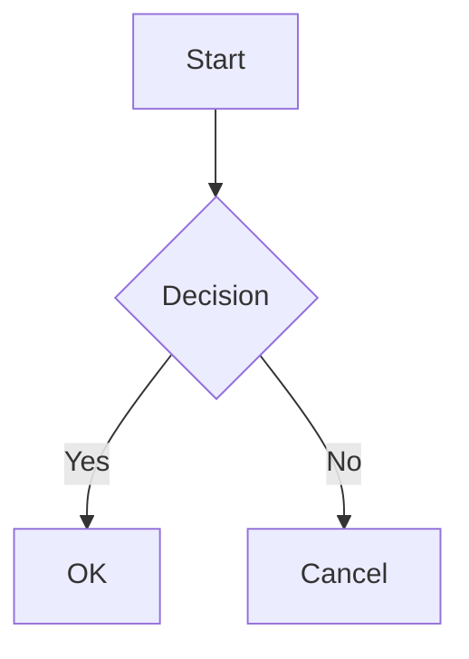

# Mantine code blocks and diagrams

Complete the [Mantine quick start](react-mantine-quick-start.md) first: both providers and the stylesheets are required for its highlighted code presentation. This guide describes the built-in `pre` renderer. Replacing that component transfers these responsibilities to your own code. See the [Mantine reference](../reference/react-mantine.md#props-api-reference) for prop defaults.

## Code Block Rendering

The Mantine package installs a default `<pre>` renderer (`MantineAIMPreCode`) that powers all code-block features. Behavior by code-block flavor:

| Code-block flavor                          | Rendered as                 | Notes                                                                                                                                                                                                                                                                                                                                                    |
| ------------------------------------------ | --------------------------- | -------------------------------------------------------------------------------------------------------------------------------------------------------------------------------------------------------------------------------------------------------------------------------------------------------------------------------------------------------- |
| Annotated, known language (e.g. ` ```ts `) | `<CodeHighlightTabs>`       | Tab label = language name (lower-cased)                                                                                                                                                                                                                                                                                                                  |
| Annotated, unknown language identifier     | `<CodeHighlightTabs>`       | Tab label = the identifier (lower-cased); Mantine's highlight adapter degrades an unknown language to plaintext                                                                                                                                                                                                                                          |
| No language annotation                     | `<CodeHighlight>` plaintext | Label = `"unknown"`. With `codeBlock.autoDetectUnknownLanguage: true`, `hljs.highlightAuto` guesses early, re-checks as the block grows, and settles at end of stream — label/highlighting upgrade in place                                                                                                                                              |
| ` ```mermaid ` (any case)                  | Interactive Mermaid diagram | See [Mermaid Diagrams](#mermaid-diagrams); the language match is case-insensitive                                                                                                                                                                                                                                                                        |
| ` ```json ` (any case)                     | Pretty-printed JSON         | As soon as the block looks complete (ends in `}`/`]` with balanced brackets outside strings), parsed, string values holding a nested JSON object/array expanded (primitive-looking strings such as `"true"` stay strings), then formatted with 2-space indent while retaining exact numeric tokens; both formatting and nested expansion can be disabled |

The copy control copies the original code text, including its trailing newline, independently of JSON display formatting. Raw HTML `<pre>` structures with nested elements, sibling text, or additional attributes retain their original rendering instead of entering the code highlighter.

All non-special blocks render with `withBorder` and `withExpandButton`, collapsing to `maxCollapsedHeight="320px"` until expanded.

### Code Highlight Adapter

Code highlighting requires a `CodeHighlightAdapterProvider` wrapping the component tree. This is a Mantine requirement -- the adapter bridges `highlight.js` into Mantine's code highlight components.

```tsx
import { CodeHighlightAdapterProvider, createHighlightJsAdapter } from '@mantine/code-highlight';
import hljs from 'highlight.js';

const highlightJsAdapter = createHighlightJsAdapter(hljs);

function App() {
  return (
    <CodeHighlightAdapterProvider adapter={highlightJsAdapter}>
      {/* MantineAIMarkdown components can be rendered anywhere below */}
    </CodeHighlightAdapterProvider>
  );
}
```

### Language Auto-Detection

By default, code blocks without an explicit language annotation render as plaintext. Enable auto-detection via the `codeBlock` prop:

```tsx
import hljs from 'highlight.js';

const CODE_BLOCK = { autoDetectUnknownLanguage: true, highlightJs: hljs };
// or load it on first use — keep the loader at module scope, the group is compared by value:
// const CODE_BLOCK = { autoDetectUnknownLanguage: true, highlightJs: () => import('highlight.js') };

<MantineAIMarkdown content={markdown} codeBlock={CODE_BLOCK} />;
```

This uses `highlight.js`'s `highlightAuto` to guess the language, run on the instance or loader you pass as `highlightJs`. The package does not import `highlight.js` itself (the peer is optional), so the option is inert without `highlightJs` and logs one warning. Passing the same instance the adapter uses — including a `highlight.js/lib/core` build with only your languages registered — keeps detection limited to what the adapter can highlight. Results may vary for short or ambiguous snippets. While a block streams, detection runs on a doubling schedule — a first guess once the block has ~32 characters, a corrective re-run each time it has doubled in length, and a final verdict when the stream ends — so an append-only stream submits O(n) total input to detection instead of re-scoring every prefix. This bounds the amount of submitted text, not the runtime of highlight.js or its language grammars. A block that is replaced rather than appended to (a regenerate) restarts the schedule. Without a `streaming` prop the renderer cannot tell chunks apart and re-detects on every content change — pass `streaming` when you stream. A loader runs once per page (cached by function identity); a failed load is retried a bounded number of times.

### Preloading the on-demand assets

`mermaid` is loaded lazily by the diagram renderer, and a `highlightJs` loader runs the first time auto-detection needs it. An app that would rather pay that cost at startup — a documentation page whose first screen shows a diagram, or a chat UI that wants to reduce the first diagram’s module-loading delay — calls the exported helper once at boot:

```tsx
import { preloadMantineCodeAssets } from '@ai-markdown/react-mantine';

void preloadMantineCodeAssets(); // mermaid only; idempotent; failures are swallowed and the renderers fall back to lazy loading
void preloadMantineCodeAssets({ highlightJs: loadHljs }); // also runs the loader you pass as codeBlock.highlightJs (same function)
```

An eager app import can also preload an asset when it resolves to the same module as the renderer's dynamic import. Use the helper when you want to load the integration's assets without depending on your application's module-resolution choices.

## Mermaid Diagrams

Fenced code blocks with the `mermaid` language identifier render as interactive SVG diagrams. The `mermaid` module is loaded on demand — the first diagram that renders pays the import (the raw source shows as a code block while it loads), and in a code-splitting bundler this can defer its chunk until needed. Actual delivery depends on your bundler and any eager imports or preload call:

````markdown

````

Features:

- Automatic dark/light theme switching driven by Mantine's color scheme
- Toggle between rendered diagram and raw source
- Copy button for the Mermaid source
- Use the header action to open the SVG in a new window; the diagram itself retains its graphics semantics
- Chart type label displayed in the header
- Graceful fallback to source-code display on parse errors; the last successful render is preserved across transient parse failures during streaming

The `mermaid` library is a direct dependency of this package -- no additional installation is needed.

## Streaming code: source, display, and asynchronous work

Ordinary code highlighting has separate source and display values. The latest source updates immediately for copying, while append-only streaming display updates can be coalesced over `highlightIntervalMs`. This is a bounded pending update: new appends do not keep postponing the same deadline indefinitely. Completion, replacement, language changes, and non-streaming updates bypass the interval so the final view catches up immediately.

The highlighter retains only its latest result for the same code, language, color scheme, and highlight function. It is not an unbounded cache of every streamed prefix. JSON formatting first validates a complete candidate, then formats tokens without converting number spellings through a stringify round trip. A nested JSON string expands only when it contains an object or array; primitive-looking strings stay strings. Nested expansion changes the display structure, so disable it when showing that distinction matters.

Mermaid has a separate asynchronous lifecycle. Initialization, parsing, and rendering are serialized, with only the latest pending request retained per instance. While streaming, render attempts are additionally throttled by `codeBlock.mermaidIntervalMs` (default 300 ms, 0 attempts every update): a mermaid render lays the diagram out synchronously, so the queue alone still kept the main thread busy back to back during a fast stream. Appended source within the interval replaces one pending frame without moving its deadline; completion and replacement pass through at once, so the final corrective render always sees the final source, and the source view and copy button always show the latest text. During an incomplete stream, the last valid diagram remains visible after transient failures; before a valid diagram exists, source provides the fallback. Completion triggers the final corrective render. Source longer than mermaid's `maxTextSize` (site config, default 50 000 characters) is refused before parsing and shown as an error with the size in plain text, instead of the placeholder diagram mermaid would otherwise substitute. The renderer enforces strict Mermaid security configuration and handles diagram generation independently of ordinary highlight coalescing.

Only a plain pre/code shape is eligible for replacement: one positioned code child containing text, no pre attributes, and no code attributes beyond language classes. Raw HTML with nested markup, siblings, or extra attributes remains a normal pre element, preserving information a highlighter would otherwise discard. A caller-provided `pre` override replaces this entire decision path; a `code` override alone does not intercept fences consumed by Mantine's pre renderer.
