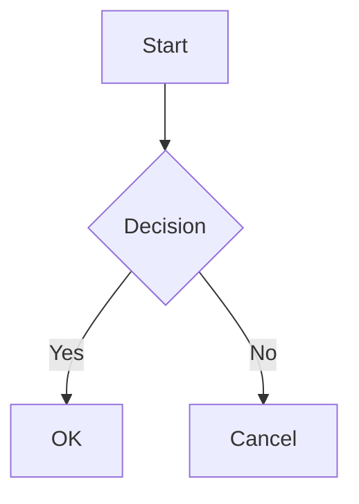

# Mantine code blocks and diagrams

Complete the [Mantine quick start](react-mantine-quick-start.md) first: both providers and the stylesheets are required for its highlighted code presentation. This guide describes the built-in `pre` renderer. Replacing that component transfers these responsibilities to your own code. See the [Mantine reference](../reference/react-mantine.md#props-api-reference) for prop defaults.

## Code Block Rendering

The Mantine package installs a default `<pre>` renderer (`MantineAIMPreCode`) that powers all code-block features. Behavior by code-block flavor:

| Code-block flavor                          | Rendered as                 | Notes                                                                                                                                                                                                                                                                                                                                                    |
| ------------------------------------------ | --------------------------- | -------------------------------------------------------------------------------------------------------------------------------------------------------------------------------------------------------------------------------------------------------------------------------------------------------------------------------------------------------- |
| Annotated, known language (e.g. ` ```ts `) | `<CodeHighlightTabs>`       | Tab label = language name as written (lower-cased); the highlighter receives it in the spelling `codeBlock.languageFormat` selects (` ```objc ` reaches highlight.js as `objectivec`, ` ```txt ` as `plaintext`)                                                                                                                                         |
| Annotated, unknown language identifier     | `<CodeHighlightTabs>`       | Tab label = the identifier (lower-cased); an identifier the `languageFormat` mapping does not translate reaches the highlighter lower-cased, and Mantine's highlight adapter degrades a language it lacks to plaintext                                                                                                                                   |
| No language annotation                     | `<CodeHighlight>` plaintext | Label = `"unknown"`. By default (`codeBlock.autoDetectUnknownLanguage: true`), `@ai-markdown/code-language-detector` labels the block during render (server rendering included) once its evidence is conclusive, and finalizes the label when the stream ends; a block it abstains on stays `"unknown"`                                                  |
| ` ```mermaid ` (any case)                  | Interactive Mermaid diagram | See [Mermaid Diagrams](#mermaid-diagrams); the language match is case-insensitive                                                                                                                                                                                                                                                                        |
| ` ```json ` (any case)                     | Pretty-printed JSON         | As soon as the block looks complete (ends in `}`/`]` with balanced brackets outside strings), parsed, string values holding a nested JSON object/array expanded (primitive-looking strings such as `"true"` stay strings), then formatted with 2-space indent while retaining exact numeric tokens; both formatting and nested expansion can be disabled |

The copy control copies the original code text, including its trailing newline, independently of JSON display formatting. Raw HTML `<pre>` structures with nested elements, sibling text, or additional attributes retain their original rendering instead of entering the code highlighter.

All non-special blocks render with `withBorder` and `withExpandButton`, collapsing to `maxCollapsedHeight="320px"` until expanded.

### Code Highlight Adapter

Code highlighting requires a `CodeHighlightAdapterProvider` wrapping the component tree. This is a Mantine requirement -- the adapter bridges a highlighter (`highlight.js` below, or Shiki through `createShikiAdapter`) into Mantine's code highlight components.

```tsx
import { CodeHighlightAdapterProvider, createHighlightJsAdapter } from '@mantine/code-highlight';
import hljs from 'highlight.js';

const highlightJsAdapter = createHighlightJsAdapter(hljs);

function App() {
  return (
    <CodeHighlightAdapterProvider adapter={highlightJsAdapter}>
      {/* MantineAIMarkdown components can be rendered anywhere below */}
    </CodeHighlightAdapterProvider>
  );
}
```

With Mantine's Shiki adapter, also set `codeBlock.languageFormat` to `MantineLanguageFormat.Shiki`; see [Highlighter Language Names](#highlighter-language-names).

### Highlighter Language Names

The renderer cannot see which adapter `CodeHighlightAdapterProvider` holds, so `codeBlock.languageFormat` states which names languages are handed to the highlighter in. It applies to every block with a language: a language written on the fence and a detected language go through the same mapping, `normalizeHighlightJsLanguage` or `normalizeShikiLanguage` from `@ai-markdown/code-language-detector`. Models write names such as `objc`, `txt`, `Makefile` or `console` that the two highlighters spell differently, so match this option to your adapter even when auto-detection is off.

| `languageFormat`                              | Adapter                    | Names passed to the highlighter                                                                                                                                                                                                                                                                                         |
| --------------------------------------------- | -------------------------- | ----------------------------------------------------------------------------------------------------------------------------------------------------------------------------------------------------------------------------------------------------------------------------------------------------------------------- |
| `MantineLanguageFormat.HighlightJs` (default) | `createHighlightJsAdapter` | highlight.js names: `objectivec`, `vbnet`, `x86asm`, `javascript` for JSX, `typescript` for TSX, `xml` for HTML, Vue and Svelte (its xml grammar highlights `<script>` and `<style>` as sub-languages), `plaintext` for `txt`, `shell` for `console`, `dos` for `bat` or `cmd`, `vim` for `viml`, `django` for `jinja2` |
| `MantineLanguageFormat.Shiki`                 | `createShikiAdapter`       | Shiki language ids: `objective-c` for `objc`, `text` for `txt` or `plaintext`, `make` for `makefile`, `bat` for `batch` or `cmd`, `shellsession` for `console`, `coffee` for `coffeescript`                                                                                                                             |

Any other name reaches the highlighter lower-cased as written, and a block with no language is highlighted as `plaintext`. A mapped name does not guarantee that the grammar is registered or loaded; Mantine's adapters degrade a language they lack to plaintext.

The tab label keeps the fence language as written (lower-cased), or the detected language's own name, and shows "unknown" only when a block has no language. Under the default, ` ```objc ` is labelled `objc` and highlighted as `objectivec`, and a detected Vue component is labelled `vue` and highlighted as `xml`. JSON pretty-printing and the Mermaid renderer key on that lower-cased name, not on the mapped one.

With the Shiki adapter, select the Shiki names:

```tsx
import MantineAIMarkdown, { MantineLanguageFormat } from '@ai-markdown/react-mantine';

const CODE_BLOCK = {
  languageFormat: MantineLanguageFormat.Shiki,
};

<MantineAIMarkdown content={markdown} codeBlock={CODE_BLOCK} />;
```

An unrecognised `languageFormat` value falls back to the default.

### Language Auto-Detection

Auto-detection is on by default: a code block without an explicit language annotation gets a label and highlighting when the detector can place it, and stays plaintext labelled "unknown" otherwise. To render every unlabelled block as plaintext, turn it off via the `codeBlock` prop:

```tsx
<MantineAIMarkdown content={markdown} codeBlock={{ autoDetectUnknownLanguage: false }} />
```

Detection uses [`@ai-markdown/code-language-detector`](../../../../packages/code-language-detector/README.md), a regular dependency of this package, so it needs no highlight.js instance and no further installation. It is synchronous and runs during render, including server rendering: the detected tab label is already in the SSR markup instead of the block first painting as "unknown" and upgrading in place. The detector abstains instead of guessing when the evidence is insufficient, and a block it abstains on stays plaintext labelled "unknown". The detector never overrides an explicit fence language. A detected language reaches the highlighter through the same [`languageFormat` mapping](#highlighter-language-names) as a written one.

While `streaming` is `true`, the detector labels a block once its evidence is conclusive and re-detects only after the block has grown meaningfully. It never lowers its confidence and never swaps to another language family mid-stream. Text that does not extend the previous text — a regenerate, including a replacement of the same length — starts detection over. When `streaming` ends, the verdict is finalized against the complete block. Pass `streaming` while tokens arrive so this policy applies.

### Preloading the on-demand assets

`mermaid` is loaded lazily by the diagram renderer. An app that would rather pay that cost at startup — a documentation page whose first screen shows a diagram, or a chat UI that wants to reduce the first diagram’s module-loading delay — calls the exported helper once at boot:

```tsx
import { preloadMantineCodeAssets } from '@ai-markdown/react-mantine';

void preloadMantineCodeAssets(); // mermaid; idempotent; failures are swallowed and the renderer falls back to lazy loading
```

The helper takes no arguments. Language detection is synchronous and ships with the package, so there is nothing to preload for it.

An eager app import can also preload mermaid when it resolves to the same module as the renderer's dynamic import. Use the helper when you want to load the integration's assets without depending on your application's module-resolution choices.

## Mermaid Diagrams

Fenced code blocks with the `mermaid` language identifier render as interactive SVG diagrams. The `mermaid` module is loaded on demand — the first diagram that renders pays the import (the raw source shows as a code block while it loads), and in a code-splitting bundler this can defer its chunk until needed. Actual delivery depends on your bundler and any eager imports or preload call:

````markdown

````

Features:

- Automatic dark/light theme switching driven by Mantine's color scheme
- Toggle between rendered diagram and raw source
- Copy button for the Mermaid source
- Use the header action to open the SVG in a new window; the diagram itself retains its graphics semantics
- Chart type label displayed in the header
- Graceful fallback to source-code display on parse errors; the last successful render is preserved across transient parse failures during streaming

The `mermaid` library is a direct dependency of this package -- no additional installation is needed.

## Streaming code: source, display, and asynchronous work

Ordinary code highlighting has separate source and display values. The latest source updates immediately for copying, while append-only streaming display updates can be coalesced over `highlightIntervalMs`. This is a bounded pending update: new appends do not keep postponing the same deadline indefinitely. Completion, replacement, language changes, and non-streaming updates bypass the interval so the final view catches up immediately.

The highlighter retains only its latest result for the same code, language, color scheme, and highlight function. It is not an unbounded cache of every streamed prefix. JSON formatting first validates a complete candidate, then formats tokens without converting number spellings through a stringify round trip. A nested JSON string expands only when it contains an object or array; primitive-looking strings stay strings. Nested expansion changes the display structure, so disable it when showing that distinction matters.

Mermaid has a separate asynchronous lifecycle. Initialization, parsing, and rendering are serialized, with only the latest pending request retained per instance. While streaming, render attempts are additionally throttled by `codeBlock.mermaidIntervalMs` (default 300 ms, 0 attempts every update): a mermaid render lays the diagram out synchronously, so the queue alone still kept the main thread busy back to back during a fast stream. Appended source within the interval replaces one pending frame without moving its deadline; completion and replacement pass through at once, so the final corrective render always sees the final source, and the source view and copy button always show the latest text. During an incomplete stream, the last valid diagram remains visible after transient failures; before a valid diagram exists, source provides the fallback. Completion triggers the final corrective render. Source longer than mermaid's `maxTextSize` (site config, default 50 000 characters) is refused before parsing and shown as an error with the size in plain text, instead of the placeholder diagram mermaid would otherwise substitute. The renderer enforces strict Mermaid security configuration and handles diagram generation independently of ordinary highlight coalescing.

Only a plain pre/code shape is eligible for replacement: one positioned code child containing text, no pre attributes, and no code attributes beyond language classes. Raw HTML with nested markup, siblings, or extra attributes remains a normal pre element, preserving information a highlighter would otherwise discard. A caller-provided `pre` override replaces this entire decision path; a `code` override alone does not intercept fences consumed by Mantine's pre renderer.
