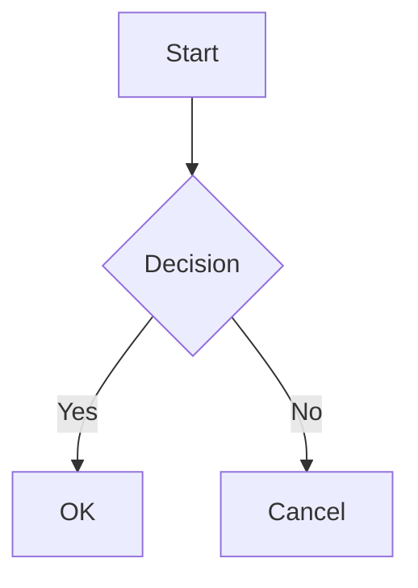

# Mantine 代码块与图表

请先完成 [Mantine 快速开始](react-mantine-quick-start.md)：语法高亮代码展示需要正确配置双层 Provider 并引入对应的样式表。本指南介绍内置的 `pre` 元素渲染器。如果你自定义替换了该组件，则需要由你自己的代码承担这些职责。属性默认值请参阅 [Mantine 参考](../reference/react-mantine.md#props-api-reference)。

## 代码块渲染 <a id="code-block-rendering"></a>

Mantine 集成包安装了一个默认的 `<pre>` 渲染器（`MantineAIMPreCode`），负责驱动所有代码块特性。针对不同类型的代码块，其渲染行为如下：

| 代码块类型                           | 渲染为                   | 行为说明                                                                                                                                                                                                                                                 |
| ------------------------------------ | ------------------------ | -------------------------------------------------------------------------------------------------------------------------------------------------------------------------------------------------------------------------------------------------------- |
| 已声明且受支持的语言（如 ` ```ts `） | `<CodeHighlightTabs>`    | 标签页标题 = 按原样书写的语言名称（转换为小写）；交给高亮器的是 `codeBlock.languageFormat` 所选拼写下的名称（` ```objc ` 以 `objectivec` 交给 highlight.js，` ```txt ` 以 `plaintext` 交给 highlight.js）                                                |
| 已声明但未知的语言标识符             | `<CodeHighlightTabs>`    | 标签页标题 = 转换为小写的标识符；`codeBlock.languageFormat` 不转换的标识符以小写形式交给高亮器，Mantine 的高亮适配器会将它不支持的语言安全降级为纯文本展示                                                                                               |
| 未声明任何语言                       | `<CodeHighlight>` 纯文本 | 标签页标题 = `"unknown"`。默认情况下（`codeBlock.autoDetectUnknownLanguage: true`），`@ai-markdown/code-language-detector` 在渲染期间（包括服务端渲染）于证据充分时标注语言，并在流式结束时确定最终结果；检测器放弃判断的代码块保持 `"unknown"`          |
| ` ```mermaid `（大小写不敏感）       | 交互式 Mermaid 图表      | 详见 [Mermaid 图表](#mermaid-diagrams)；语言匹配不区分大小写                                                                                                                                                                                             |
| ` ```json `（大小写不敏感）          | 美化格式化后的 JSON      | 代码块一旦呈现完整形态（以 `}` 或 `]` 结尾且括号在字符串外对称闭合），即会进行解析；字符串中嵌套的 JSON 对象/数组会被展开（原始字面量风格的字符串如 `"true"` 保持为字符串），并以 2 空格缩进排版，同时保留精确的数值 Token；格式化和嵌套展开均可单独关闭 |

无论 JSON 显示如何美化，点击复制按钮均会复制最原始的代码文本（包含尾部换行符）。包含嵌套元素、兄弟文本或额外属性的原生 HTML `<pre>` 结构会保持原生渲染，不会错误进入代码高亮器。

所有常规代码块默认携带 `withBorder` 边框与 `withExpandButton` 展开按钮，默认折叠至 `maxCollapsedHeight="320px"`，直至用户点击展开。

### 代码高亮适配器

代码高亮要求在组件树外层包裹 `CodeHighlightAdapterProvider`。这是 Mantine 的官方要求——该适配器将高亮器（下例中的 `highlight.js`，或通过 `createShikiAdapter` 接入的 Shiki）桥接到 Mantine 的代码高亮组件中。

```tsx
import { CodeHighlightAdapterProvider, createHighlightJsAdapter } from '@mantine/code-highlight';
import hljs from 'highlight.js';

const highlightJsAdapter = createHighlightJsAdapter(hljs);

function App() {
  return (
    <CodeHighlightAdapterProvider adapter={highlightJsAdapter}>
      {/* MantineAIMarkdown components can be rendered anywhere below */}
    </CodeHighlightAdapterProvider>
  );
}
```

使用 Mantine 的 Shiki 适配器时，还需要把 `codeBlock.languageFormat` 设为 `MantineLanguageFormat.Shiki`，详见[高亮器语言名称](#highlighter-language-names)。

### 高亮器语言名称 <a id="highlighter-language-names"></a>

渲染器无法得知 `CodeHighlightAdapterProvider` 中使用的是哪个适配器，因此由 `codeBlock.languageFormat` 说明语言以哪套名称交给高亮器。它作用于所有带语言的代码块：书写在围栏上的语言和检测出的语言都经过同一个映射函数，即 `@ai-markdown/code-language-detector` 的 `normalizeHighlightJsLanguage` 或 `normalizeShikiLanguage`。模型会写出 `objc`、`txt`、`Makefile`、`console` 这类两个高亮器拼写不同的名称，因此即使不开启自动检测，也应让该选项与适配器保持一致。

| `languageFormat`                              | 适配器                     | 交给高亮器的名称                                                                                                                                                                                                                                                                                                 |
| --------------------------------------------- | -------------------------- | ---------------------------------------------------------------------------------------------------------------------------------------------------------------------------------------------------------------------------------------------------------------------------------------------------------------- |
| `MantineLanguageFormat.HighlightJs`（默认值） | `createHighlightJsAdapter` | highlight.js 名称：`objectivec`、`vbnet`、`x86asm`，JSX 对应 `javascript`，TSX 对应 `typescript`，HTML、Vue 与 Svelte 对应 `xml`（其 xml 语法会把 `<script>` 与 `<style>` 作为子语言高亮），`txt` 对应 `plaintext`，`console` 对应 `shell`，`bat` 或 `cmd` 对应 `dos`，`viml` 对应 `vim`，`jinja2` 对应 `django` |
| `MantineLanguageFormat.Shiki`                 | `createShikiAdapter`       | Shiki 语言 id：`objc` 对应 `objective-c`，`txt` 或 `plaintext` 对应 `text`，`makefile` 对应 `make`，`batch` 或 `cmd` 对应 `bat`，`console` 对应 `shellsession`，`coffeescript` 对应 `coffee`                                                                                                                     |

其他名称转换为小写后原样交给高亮器；没有语言的代码块按 `plaintext` 高亮。映射得到的名称并不保证对应的 grammar 已注册或已加载；Mantine 的适配器会把不支持的语言降级为纯文本。

标签页标题保留围栏上书写的语言（转换为小写），或检测出的语言本身的名称；只有代码块没有语言时才显示“unknown”。在默认设置下，` ```objc ` 的标签为 `objc`，按 `objectivec` 高亮；检测出的 Vue 组件标签为 `vue`，按 `xml` 高亮。JSON 美化格式化与 Mermaid 渲染依据的是这个小写名称，而不是映射后的名称。

使用 Shiki 适配器时，请选择 Shiki 名称：

```tsx
import MantineAIMarkdown, { MantineLanguageFormat } from '@ai-markdown/react-mantine';

const CODE_BLOCK = {
  languageFormat: MantineLanguageFormat.Shiki,
};

<MantineAIMarkdown content={markdown} codeBlock={CODE_BLOCK} />;
```

无法识别的 `languageFormat` 值会回退为默认值。

### 语言自动检测

自动检测默认开启：未标注语言的代码块在检测器能够判定时会得到标签与语法高亮，否则保持纯文本，标签为“unknown”。如果希望所有未标注语言的代码块都按纯文本渲染，可通过 `codeBlock` 属性关闭：

```tsx
<MantineAIMarkdown content={markdown} codeBlock={{ autoDetectUnknownLanguage: false }} />
```

检测由 [`@ai-markdown/code-language-detector`](../../../../packages/code-language-detector/README.md) 完成。它是本包的常规依赖，因此无需提供 highlight.js 实例，也无需额外安装。检测是同步的，在渲染期间执行，包括服务端渲染：检测出的标签页标题直接出现在 SSR 标记中，代码块不会先显示“unknown”再原位升级。证据不足时检测器会放弃判断而不是猜测，被放弃的代码块保持纯文本，标签为“unknown”。检测器永远不会覆盖显式声明的围栏语言。检测出的语言与书写在围栏上的语言经由同一套 [`languageFormat` 映射](#highlighter-language-names)交给高亮器。

`streaming` 为 `true` 期间，检测器在证据充分时才为代码块标注语言，之后只有代码块明显增长才会重新检测。它不会降低已有的置信度，也不会在流式中途切换到另一个语言家族。如果新文本不是在旧文本之后追加（例如重新生成，包括长度相同的替换），检测会从头开始。`streaming` 结束时，检测器基于完整代码块确定最终结果。流式传输时请传入 `streaming`，以便应用上述策略。

### 预加载按需资源

`mermaid` 由图表渲染器惰性加载。如果应用希望在启动时提前承担此项开销——例如首屏即包含图表的文档页，或希望消除首个图表模块加载延迟的聊天界面——可在应用启动时调用导出的预加载函数一次：

```tsx
import { preloadMantineCodeAssets } from '@ai-markdown/react-mantine';

void preloadMantineCodeAssets(); // mermaid；幂等；失败被吞掉，渲染器回退为惰性加载
```

该函数不接受参数。语言检测是同步的，且随包一起提供，因此无需为它预加载任何资源。

当应用自身的预加载能够解析为与渲染器动态导入相同的 mermaid 模块时，也可以直接采用应用层的静态导入。当你希望独立于应用的模块解析策略预加载集成资源时，请使用该辅助函数。

## Mermaid 图表 <a id="mermaid-diagrams"></a>

声明了 `mermaid` 语言标识的代码围栏会被渲染为交互式 SVG 矢量图表。`mermaid` 模块采用按需加载——首个渲染的图表会承担模块导入开销（在加载期间原样显示为代码块源码），在支持代码分割的打包工具中可将该分块延迟加载。实际加载体验取决于你的打包工具以及是否配置了静态导入或预加载：

````markdown

````

核心特性：

- 随 Mantine 配色方案自动切换亮色/暗色主题
- 支持在渲染后的图表与原始代码之间自由切换
- 提供针对 Mermaid 源码的一键复制按钮
- 顶部操作栏支持在新窗口中打开生成的 SVG；图表本身保留矢量图形语义
- 标题栏清晰展示当前图表类型标识
- 遇到解析错误时平滑回退为源码展示；在流式生成期间遇到短暂的未闭合解析失败时，仍能保留最近一次成功渲染的图表

`mermaid` 库属于本包的直接依赖——无需单独手动安装。

## 流式代码：源码、展示与异步任务 <a id="streaming-code-source-display-and-asynchronous-work"></a>

常规代码高亮内部严格区分**源码值**与**展示值**。最新的源码会立即同步，以供复制按钮使用；而纯追加的流式展示更新则可以通过 `highlightIntervalMs` 进行时间合并。这是一个有界的挂起更新窗口：新的追加不会无休止地推迟同一个截止时间。当流式结束、文本被替换、语言发生变更或进行非流式更新时，系统会跳过合并间隔，使最终视图瞬间追赶至最新状态。

高亮器仅为相同的代码、语言、配色方案和高亮函数保留最新的计算结果，它不是一个无节制缓存每个流式前缀的无限存储。JSON 格式化首先校验候选串的完整性，随后在不经过 `JSON.stringify` 往返的情况下直接对 Token 进行排版，避免数值文本格式被意外篡改。嵌套的 JSON 字符串仅在包含对象或数组时才会展开；看起来像原始字面量的字符串保持不变。嵌套展开会改变视觉展示结构，因此在需要严格保留原始字面形式时请将其关闭。

Mermaid 拥有完全独立的异步生命周期。初始化、语法解析与渲染操作按序串行化执行，每个实例仅保留最新的挂起请求。流式期间渲染尝试还会按 `codeBlock.mermaidIntervalMs` 节流（默认 300 毫秒，设为 0 则每次更新都尝试）：Mermaid 渲染会同步完成图表布局，仅靠队列在快速流式输入下仍会让主线程连续忙碌。间隔内追加的源码只替换同一个挂起帧而不推迟其截止时间；流结束与整段替换会立即放行，因此最终校正渲染看到的一定是最终源码，源码视图与复制按钮也始终显示最新文本。在未闭合的流式生成过程中，遇到偶发失败时会持续保持展示最近一个有效的合法图表；在产生第一个合法图表之前，则以源码作为回退展示。生成彻底结束后会触发最终的校正渲染。超过 Mermaid `maxTextSize`（站点配置，默认 50 000 字符）的源码会在解析前被拒绝，并以纯文本形式给出包含长度的错误信息，而不是 Mermaid 原本替换进去的占位图表。渲染器强制执行了严格的 Mermaid 安全配置，并独立于常规代码的高亮合并机制进行图表绘制。

只有标准的 pre/code 结构才会被自动替换：即单个承载文本内容的 code 子节点、pre 上无自定义属性、code 上除了语言 class 之外无多余属性。包含嵌套标记、兄弟元素或额外属性的原始 HTML 会保持原生 pre 元素输出，从而完整保留高亮器本会丢弃的结构信息。如果调用方传入了自定义 `pre` 组件覆盖，将接管整条决策链路；仅单独覆盖 `code` 组件无法拦截已经被 Mantine pre 渲染器使用的代码围栏。
